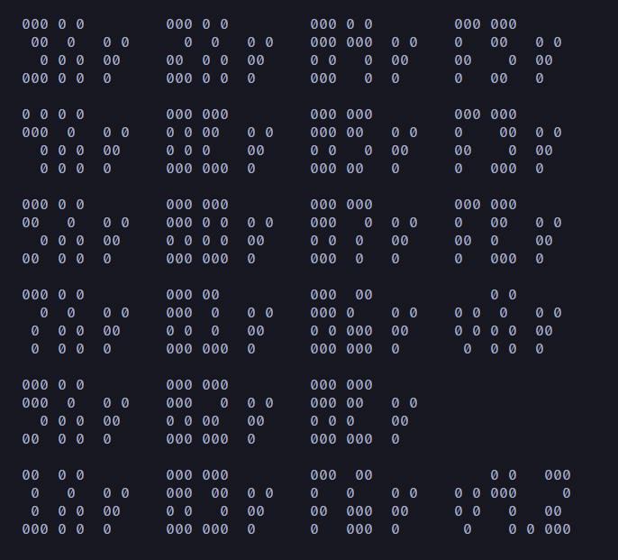
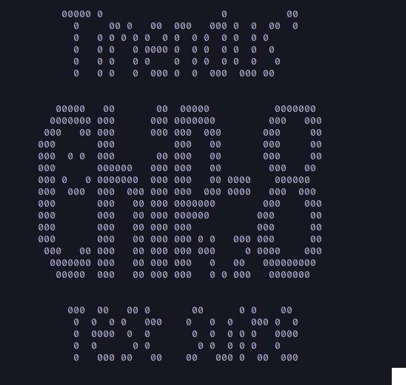
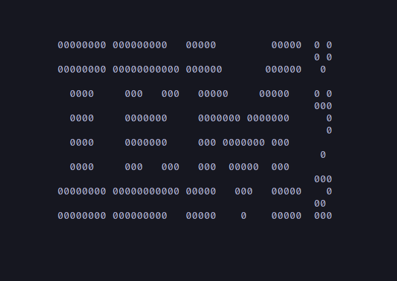

# Chip 8 implementation in Java
CPU emulation study project, using Chip 8 architecture.

Currently passes Corax+ test, writing the screen to console, although interaction with the machine is not implemented yet.
Dumps RAM and execution log into dump.txt.

Example usage:
```bash
java -jar chip8.jar -r "path/to/rom.ch8" -l 0
```
Corax test:


Chip8 Test Suite logo:


IBM logo:

